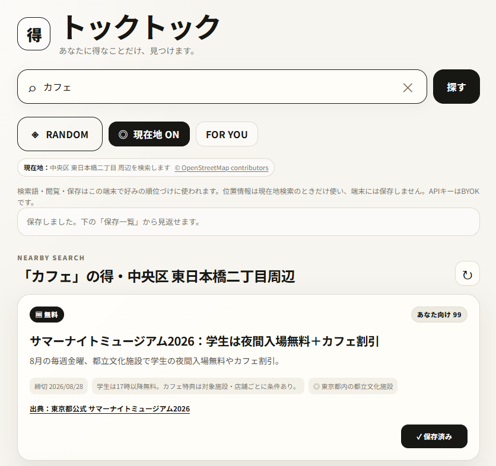

# トックトック / TOKTOK

**あなたに得なことだけ、見つけます。**  
Search the web for deals, freebies, gifts and local offers — then learn what is valuable to you.

### 検索画面



### 保存一覧


> Screenshots use illustrative sample results. Actual offers are retrieved from the web and should be verified at the source before use.

## What is TOKTOK?

トックトックは、ネット上の「得」を探すBYOK型PWAです。

検索欄に「ガジェット」「無料ソフト」「プレゼント」などを入力すると、現在有効なお得情報を検索します。「居酒屋」「カフェ」「ランチ」など地域に関係する言葉では、許可した場合に現在地を使い、近辺のクーポン・ハッピーアワー・予約特典などを優先します。

使うほど検索・閲覧・保存から好みを学習します。一方で **RANDOM** は趣向も現在地も使いません。おすすめだけに閉じず、普段なら見なかった「得」へ横に広げるための機能です。

## Features

- 🔎 キーワードから現在のお得情報を検索
- 📍 現在地周辺のお得情報を優先する Nearby Search
- 🎲 **RANDOM** — 趣向・現在地を使わず、未知のジャンルへ広げる
- ✨ **FOR YOU** — 検索・閲覧・保存から端末内で好みを学習
- 🎁 プレゼント / 全員もらえる / 抽選
- 🆓 無料配布 / 無料公開 / 無料イベント
- 🉐 セール / クーポン / ポイント / 予約特典
- 🔖 「保存」1ボタンで保存し、保存一覧から見返せる
- 📱 PWA対応
- 🔑 **BYOK** — 利用者自身のOpenAI APIキーを使用

### 保存一覧

保存した情報は、締切・条件・エリア・出典と一緒に一覧で見返せます。検索結果カードの「保存」を押すと、画面下部の「保存一覧」からいつでも確認できます。

## How it works

1. 検索キーワードを入力します。
2. 地域依存の検索では、必要に応じてブラウザが現在地の許可を求めます。
3. OpenAI Responses API + Web Search が現在有効な情報を検索・整理します。
4. 検索語・出典リンクの閲覧・保存した情報はブラウザ内の好み学習に使われ、FOR YOUの順位づけに反映されます。
5. RANDOMでは学習した趣向と現在地を送らず、意図的にフィルターバブルの外を探します。

## BYOK / Privacy

OpenAI APIキーはアプリ下部の `API KEY` から入力します。

- APIキーは利用者のブラウザの `localStorage` に保存されます。
- Cloudflare Secret や外部DBには保存しません。
- 検索時のみ、同一サイトの Cloudflare Pages Function を経由してOpenAI APIへ送信します。
- 位置情報の緯度・経度は `localStorage` に保存しません。
- 現在地検索時のみ位置情報を使います。
- 共有PCではAPIキーを保存しないでください。

## Location search

位置情報はブラウザの Geolocation API で取得します。地域名への変換には OpenStreetMap Nominatim を使用し、重複アクセスを減らすため丸めた位置をキャッシュします。

公開Nominatimは小規模利用向けです。利用規模が大きくなった場合は、商用ジオコーディングサービス等への切り替えを想定しています。

## Deploy to Cloudflare Pages

Cloudflare側へのOpenAI APIキー登録は不要です。

```powershell
npx wrangler pages deploy . --project-name tok-tok
```

すでに `tok-tok` プロジェクトがある場合は、同じプロジェクトへ更新デプロイできます。

## Stack

- Vanilla HTML / CSS / JavaScript
- PWA / Service Worker
- Cloudflare Pages + Pages Functions
- OpenAI Responses API + Web Search
- OpenStreetMap Nominatim
- Browser Geolocation API
- localStorage-based preference learning

## Notes

お得情報は価格、在庫、応募条件、営業時間、期限などが変わる場合があります。利用前に必ず出典リンク先の最新情報を確認してください。

---

**TOKTOK v0.1.3 SAVE / LOCATION / BYOK**
